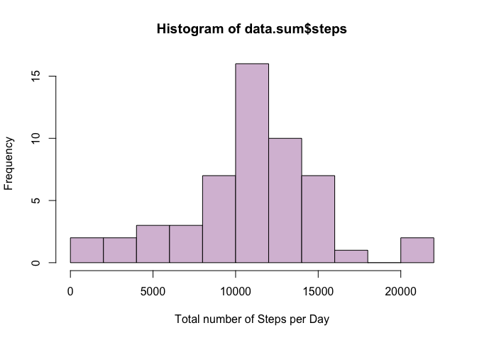
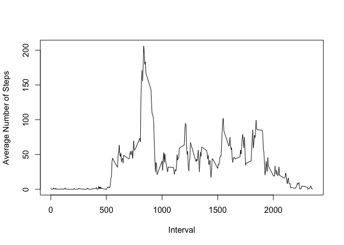
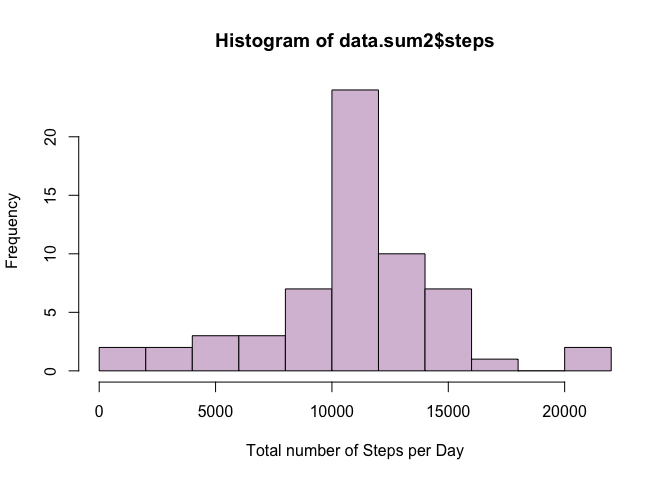
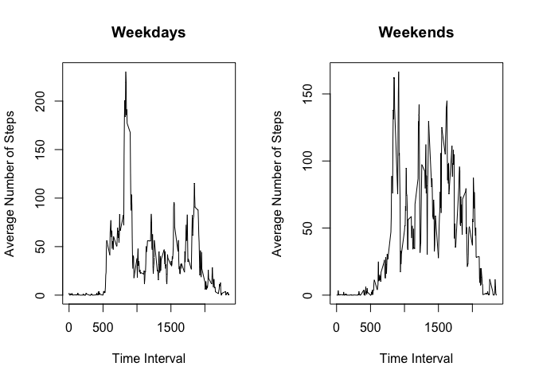

## Loading and preprocessing the data

1. Load Data


```r
destfile <- "activity.zip"
if (!file.exists(destfile)) {
    download.file("https://d396qusza40orc.cloudfront.net/repdata%2Fdata%2Factivity.zip", 
        destfile, method = "curl")
}
file <- unz(destfile, unzip(destfile, list = TRUE)[1, "Name"])
data <- read.csv(file, colClasses = c("numeric", "character", "numeric"), na.strings = "NA")
```

2. Convert Date varible into Date class 


```r
data$date<- as.Date(data$date)
```

## What is mean total number of steps taken per day?

1. Calculate total number of steps per day


```r
data.sum<- aggregate(steps~date, data, sum)
```

2. Make a histogram of the total number of steps taken each day


```r
hist(data.sum$steps,
     breaks=10, 
     xlab= "Total number of Steps per Day",
     col="thistle")
```

<!-- -->

3. Calculate **Mean** and **Median** total number of steps per day

- mean 

```r
mean(data.sum$steps)
```

```
## [1] 10766.19
```
- median

```r
median(data.sum$steps)
```

```
## [1] 10765
```

## What is the average daily activity pattern?

1. Calculate average number of steps per time interval

```r
data.mean<- aggregate(steps~interval,data, mean)
```

2. Time series plot of average number of steps per time interval


```r
plot(data.mean$interval,data.mean$steps, 
     type="l",
     xlab="Interval",
     ylab="Average Number of Steps")
```

<!-- -->

3. Calculate interval with the highest average number of steps


```r
data.mean[data.mean$steps==max(data.mean$steps),"interval"]
```

```
## [1] 835
```

## Imputing missing values

1. Calculate number of missing values in data set


```r
sum(is.na(data))
```

```
## [1] 2304
```
2. Devise a strategy for filling in all of the missing values in the dataset

Mean number of steps at a given time interval will be used to fill in
any missing data

3. Create new data set with any missing values filled in


```r
data.new<- data

data.new[is.na(data.new)] <- rep(data.mean$steps,
                                 nrow(data.new)/nrow(data.mean))[is.na(data.new)] 
```

4. Make a new histogram of the number of steps taken each day


```r
data.sum2<- aggregate(steps~date, data.new, sum)

hist(data.sum2$steps,
     breaks=10, 
     xlab= "Total number of Steps per Day",
     col="thistle")
```

<!-- -->

5. Calculate the new **Mean** and **Median** number of steps per day
- mean 

```r
mean(data.sum2$steps)
```

```
## [1] 10766.19
```
-median

```r
median(data.sum2$steps)
```

```
## [1] 10766.19
```

The Median number of steps per day is now equal to the orginal Mean number of 
Steps per day. The mean remains unchanged.

## Are there differences in activity patterns between weekdays and weekends?

1. Create a factor variable **day** with levels **weekend** and **weekday**


```r
data.new$day<- weekdays(data.new$date)
data.new$day[!(data.new$day %in% c("Saturday", "Sunday"))]<- "weekday"
data.new$day[data.new$day %in% c("Saturday", "Sunday")]<- "weekend"
```

2. Time series plot of average number of steps per interval on weekdays vs 
weekends


```r
data.mean2<- aggregate(steps~interval+day, data.new,mean)

par(mfcol=c(1,2))

plot(data.mean2$interval[data.mean2$day=="weekday"],
     data.mean2$steps[data.mean2$day== "weekday"],
     type="l",
     xlab="Time Interval",
     ylab="Average Number of Steps",
     main="Weekdays")
 plot(data.mean2$interval[data.mean2$day=="weekend"],
      data.mean2$steps[data.mean2$day=="weekend"],
      type="l",
      xlab="Time Interval",
      ylab="Average Number of Steps",
      main="Weekends")
```

<!-- -->

 


